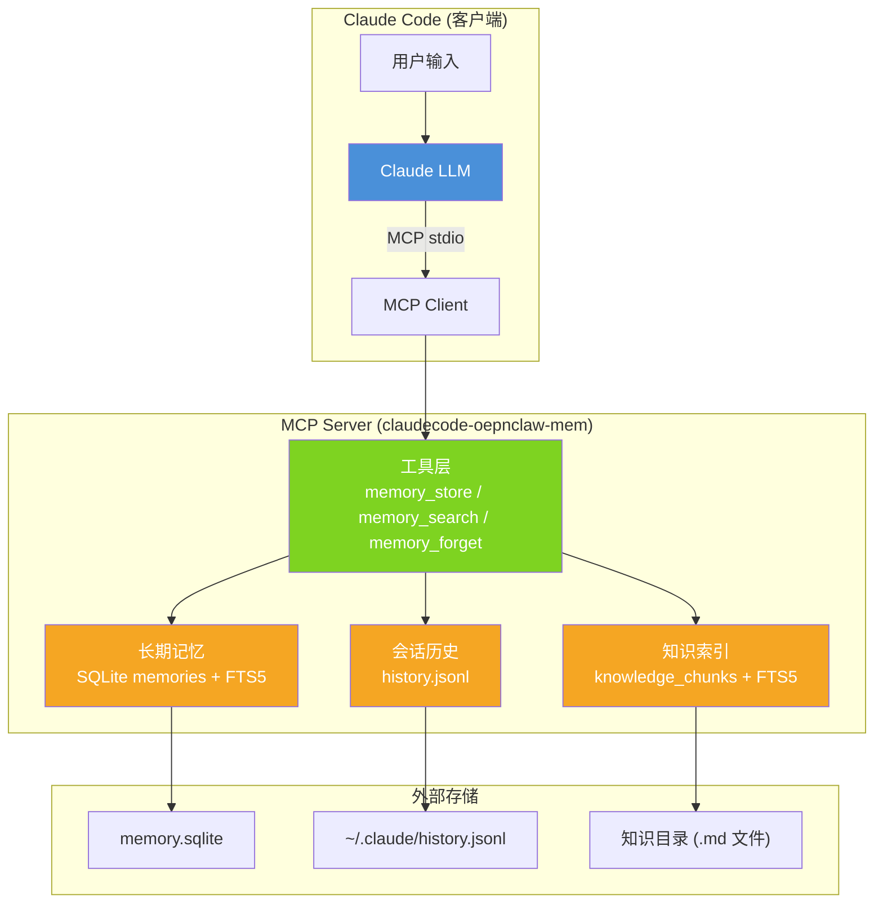
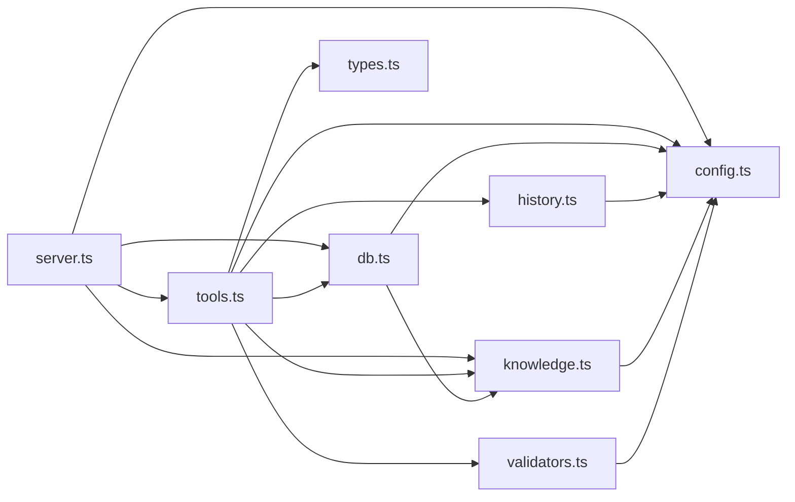
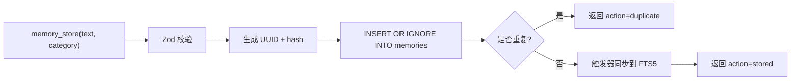
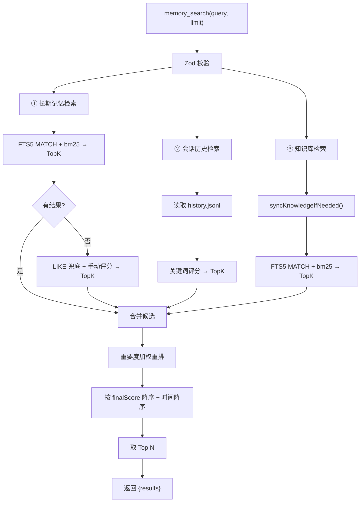
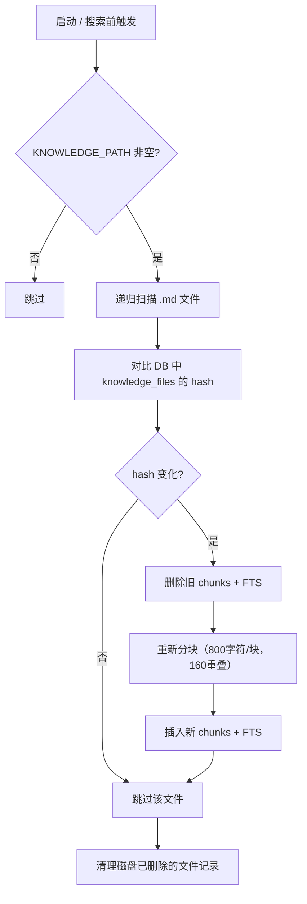
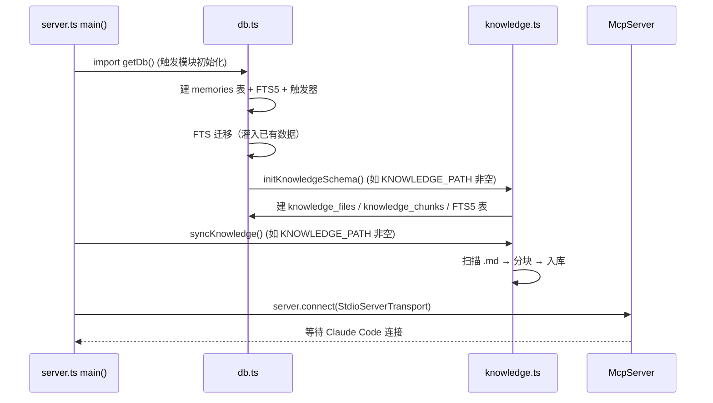
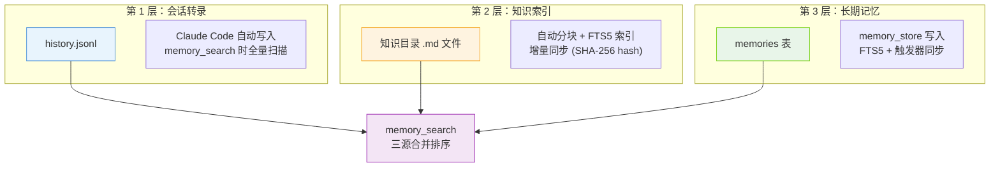

# MCP 记忆服务架构文档

> `claudecode-oepnclaw-mem` — 为 Claude Code 提供跨会话长期记忆的 MCP Server。

## 1. 整体架构



## 2. 源码结构

```
src/
├── server.ts       # MCP Server 入口，注册工具，启动 stdio 传输
├── tools.ts        # 三个工具的业务逻辑（store / search / forget）
├── db.ts           # SQLite 初始化，建表 + FTS5 + 触发器 + 迁移
├── knowledge.ts    # 知识索引：分块、增量同步、FTS5 搜索
├── history.ts      # 读取 Claude Code history.jsonl
├── validators.ts   # Zod schema 校验
├── config.ts       # 环境变量配置
└── types.ts        # TypeScript 类型定义
```

### 2.1 模块依赖关系



## 3. 数据模型

### 3.1 长期记忆（第 3 层）

```sql
-- 主表
CREATE TABLE memories (
  id         TEXT PRIMARY KEY,    -- UUID
  text       TEXT NOT NULL,       -- 记忆文本
  category   TEXT NOT NULL,       -- preference / fact / decision / entity / other
  created_at INTEGER NOT NULL,    -- 时间戳 (ms)
  hash       TEXT                -- sha256(text + category)
);

-- 去重约束
CREATE UNIQUE INDEX idx_memories_hash ON memories(hash);

-- FTS5 全文索引（通过触发器自动同步）
CREATE VIRTUAL TABLE memories_fts
USING fts5(id UNINDEXED, text, category UNINDEXED,
           content=memories, content_rowid=rowid, tokenize='unicode61');
```

### 3.2 知识索引（第 2 层）

```sql
-- 文件元数据（增量检测）
CREATE TABLE knowledge_files (
  path  TEXT PRIMARY KEY,    -- 相对于知识目录
  hash  TEXT NOT NULL,       -- SHA-256
  mtime INTEGER NOT NULL,
  size  INTEGER NOT NULL
);

-- 分块内容
CREATE TABLE knowledge_chunks (
  id         TEXT PRIMARY KEY,   -- UUID
  file_path  TEXT NOT NULL,
  text       TEXT NOT NULL,      -- 块内容
  start_line INTEGER NOT NULL,
  end_line   INTEGER NOT NULL,
  hash       TEXT NOT NULL,      -- SHA-256
  updated_at INTEGER NOT NULL
);

-- FTS5 全文索引
CREATE VIRTUAL TABLE knowledge_chunks_fts
USING fts5(text, id UNINDEXED, file_path UNINDEXED, tokenize='unicode61');
```

### 3.3 会话历史（第 1 层）

不自建存储，直接读取 Claude Code 的 `~/.claude/history.jsonl`。每行一个 JSON 对象：

```json
{ "display": "用户的 prompt", "timestamp": 1708000000000, "project": "/path", "sessionId": "..." }
```

## 4. 工作流程

### 4.1 memory_store — 写入记忆



### 4.2 memory_search — 搜索记忆



### 4.3 memory_forget — 删除记忆


### 4.4 知识索引同步流程



## 5. 检索策略

### 5.1 评分与排序

| 数据源 | 检索方式 | 基础评分 |
|--------|----------|----------|
| 长期记忆 | FTS5 MATCH (LIKE 兜底) | `bm25()` 取反 / 手动评分 |
| 会话历史 | 全量扫描 | `scoreText()` 关键词评分 |
| 知识索引 | FTS5 MATCH | `bm25()` 取反 |

**重排策略**：
- 每个来源先取 TopK 候选
- `finalScore = baseScore + importanceBoost`
- `importanceBoost` 由**来源权重 + 结构权重 + 类别权重**组成
- 按 `finalScore` 降序 → `createdAt` 降序取 Top N

### 5.2 重要度加权

- **来源权重**：memory > knowledge > history
- **结构权重**：标题行（`^#`）、列表项（`^-`/`*`/`\d+\.`）、代码块（```）
- **类别权重**：`decision`、`preference` 适度加权

### 5.3 FTS5 查询构造

```
原始 query: "API 配置方法"
  → 分词: ["API", "配置方法"]
  → FTS5 query: "API"* OR "配置方法"*
```

- 标点符号替换为空格
- 每个 token 加 `"..."*` 支持前缀匹配
- 多个 token 用 `OR` 连接
- unicode61 tokenizer 支持中英文

## 6. 启动流程



## 7. 配置项

| 环境变量 | 默认值 | 说明 |
|----------|--------|------|
| `MCP_MEMORY_DB_PATH` | `./memory.sqlite` | SQLite 数据库路径 |
| `MCP_MEMORY_CLAUDE_HISTORY_PATH` | `~/.claude/history.jsonl` | 会话历史文件 |
| `MCP_MEMORY_KNOWLEDGE_PATH` | （空） | 知识目录，为空则不启用知识索引 |
| `MCP_MEMORY_DEFAULT_LIMIT` | `5` | 默认搜索结果数 |
| `MCP_MEMORY_MAX_LIMIT` | `20` | 最大搜索结果数 |

## 8. 三层记忆体系



| 层级 | 数据来源 | 写入方式 | 索引方式 | 特点 |
|------|----------|----------|----------|------|
| 第 1 层 | `history.jsonl` | Claude Code 自动 | 全量扫描 + 关键词评分 | 零配置，低精度 |
| 第 2 层 | 知识目录 `.md` | 用户手动放文件 | FTS5 分块索引 | 高精度，需维护文件 |
| 第 3 层 | `memory_store` | Claude Code 调用 / 用户触发 | FTS5 + 触发器 | 精准，CLAUDE.md 驱动 |
