# Architecture Document

> `claudecode-infinite-memory` — An MCP Server providing cross-session long-term memory for Claude Code.

## 1. Overall Architecture

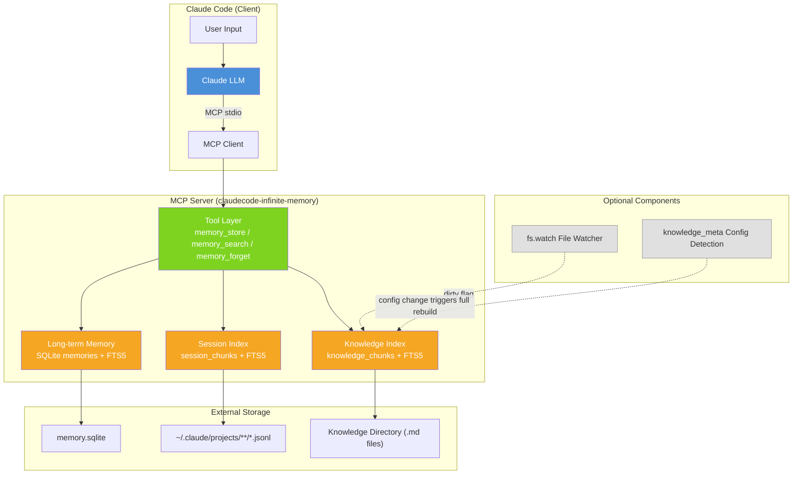
```mermaid
graph TB
    subgraph "Claude Code (Client)"
        U["User Input"] --> LLM["Claude LLM"]
        LLM -->|MCP stdio| CLIENT["MCP Client"]
    end

    subgraph "MCP Server (claudecode-infinite-memory)"
        CLIENT --> TOOLS["Tool Layer<br/>memory_store / memory_search / memory_forget"]

        TOOLS --> DB["Long-term Memory<br/>SQLite memories + FTS5"]
        TOOLS --> SESS["Session Index<br/>session_chunks + FTS5"]
        TOOLS --> KNOW["Knowledge Index<br/>knowledge_chunks + FTS5"]
    end

    subgraph "External Storage"
        DB --> SQLITE["memory.sqlite"]
        SESS --> JSONL["~/.claude/projects/**/*.jsonl"]
        KNOW --> MDDIR["Knowledge Directory (.md files)"]
    end

    subgraph "Optional Components"
        WATCHER["fs.watch File Watcher"]
        META["knowledge_meta Config Detection"]
    end

    WATCHER -.->|dirty flag| KNOW
    META -.->|config change triggers full rebuild| KNOW

    style LLM fill:#4a90d9,color:#fff
    style TOOLS fill:#7ed321,color:#fff
    style DB fill:#f5a623,color:#fff
    style SESS fill:#f5a623,color:#fff
    style KNOW fill:#f5a623,color:#fff
    style WATCHER fill:#e0e0e0,stroke:#999
    style META fill:#e0e0e0,stroke:#999
```

## 2. Source Structure

```
src/
├── server.ts       # MCP Server entry point — tool registration, stdio transport, watcher init
├── tools.ts        # Core logic for memory_store / search / forget
├── db.ts           # SQLite init — tables, FTS5, triggers, migrations
├── knowledge.ts    # Knowledge indexing — chunking, incremental sync, meta, watcher, FTS5 search
├── sessions.ts     # Session indexing — JSONL parsing, message extraction, chunking, FTS5 search
├── history.ts      # Reads Claude Code history.jsonl (legacy Layer 1)
├── validators.ts   # Zod schema validation
├── config.ts       # Environment variable configuration
└── types.ts        # TypeScript type definitions
```

### 2.1 Module Dependency Graph

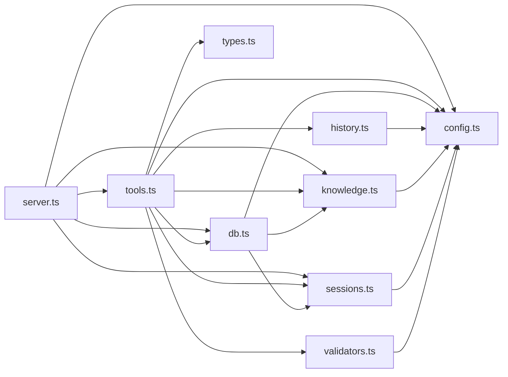
```mermaid
graph LR
    SERVER["server.ts"] --> TOOLS["tools.ts"]
    SERVER --> CONFIG["config.ts"]
    SERVER --> DB["db.ts"]
    SERVER --> KNOWLEDGE["knowledge.ts"]
    SERVER --> SESSIONS["sessions.ts"]

    TOOLS --> DB
    TOOLS --> HISTORY["history.ts"]
    TOOLS --> KNOWLEDGE
    TOOLS --> SESSIONS
    TOOLS --> VALIDATORS["validators.ts"]
    TOOLS --> CONFIG
    TOOLS --> TYPES["types.ts"]

    DB --> CONFIG
    DB --> KNOWLEDGE
    DB --> SESSIONS
    HISTORY --> CONFIG
    KNOWLEDGE --> CONFIG
    SESSIONS --> CONFIG
    VALIDATORS --> CONFIG
```

## 3. Data Model

### 3.1 Long-term Memory (Layer 3)

```sql
-- Main table
CREATE TABLE memories (
  id         TEXT PRIMARY KEY,    -- UUID
  text       TEXT NOT NULL,       -- Memory text
  category   TEXT NOT NULL,       -- preference / fact / decision / entity / other
  created_at INTEGER NOT NULL,    -- Timestamp (ms)
  hash       TEXT                 -- sha256(text + category)
);

-- Deduplication constraint
CREATE UNIQUE INDEX idx_memories_hash ON memories(hash);

-- FTS5 full-text index (auto-synced via triggers)
CREATE VIRTUAL TABLE memories_fts
USING fts5(id UNINDEXED, text, category UNINDEXED,
           content=memories, content_rowid=rowid, tokenize='unicode61');
```

### 3.2 Knowledge Index (Layer 2)

```sql
-- File metadata (for incremental detection)
CREATE TABLE knowledge_files (
  path  TEXT PRIMARY KEY,    -- Relative to knowledge directory
  hash  TEXT NOT NULL,       -- SHA-256
  mtime INTEGER NOT NULL,
  size  INTEGER NOT NULL
);

-- Chunked content
CREATE TABLE knowledge_chunks (
  id         TEXT PRIMARY KEY,   -- UUID
  file_path  TEXT NOT NULL,
  text       TEXT NOT NULL,      -- Chunk content
  start_line INTEGER NOT NULL,
  end_line   INTEGER NOT NULL,
  hash       TEXT NOT NULL,      -- SHA-256
  updated_at INTEGER NOT NULL
);

-- FTS5 full-text index
CREATE VIRTUAL TABLE knowledge_chunks_fts
USING fts5(text, id UNINDEXED, file_path UNINDEXED, tokenize='unicode61');

-- Index metadata (config change detection)
CREATE TABLE knowledge_meta (
  key   TEXT PRIMARY KEY,
  value TEXT NOT NULL
);
```

**`knowledge_meta` entries:**

| Key | Description |
|-----|-------------|
| `chunk_config` | Chunk parameter signature (tokens/overlap/version); triggers full rebuild on change |
| `last_sync` | Last sync timestamp |

### 3.3 Session Index (Layer 1)

```sql
-- File metadata
CREATE TABLE session_files (
  path  TEXT PRIMARY KEY,
  hash  TEXT NOT NULL,
  mtime INTEGER NOT NULL,
  size  INTEGER NOT NULL
);

-- Chunked session content
CREATE TABLE session_chunks (
  id         TEXT PRIMARY KEY,
  file_path  TEXT NOT NULL,
  session_id TEXT NOT NULL,
  project    TEXT,
  text       TEXT NOT NULL,
  start_idx  INTEGER NOT NULL,
  end_idx    INTEGER NOT NULL,
  hash       TEXT NOT NULL,
  start_time INTEGER NOT NULL DEFAULT 0,
  end_time   INTEGER NOT NULL DEFAULT 0,
  updated_at INTEGER NOT NULL
);

-- FTS5 full-text index
CREATE VIRTUAL TABLE session_chunks_fts
USING fts5(text, id UNINDEXED, file_path UNINDEXED, session_id UNINDEXED, tokenize='unicode61');
```

### 3.4 Legacy History (Layer 1 fallback)

Reads Claude Code's `~/.claude/history.jsonl` directly. Each line is a JSON object:

```json
{ "display": "user prompt text", "timestamp": 1708000000000, "project": "/path", "sessionId": "..." }
```

## 4. Workflows

### 4.1 memory_store — Write Memory

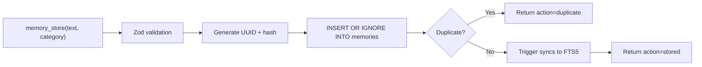
```mermaid
flowchart LR
    A["memory_store(text, category)"] --> B["Zod validation"]
    B --> C["Generate UUID + hash"]
    C --> D["INSERT OR IGNORE INTO memories"]
    D --> E{Duplicate?}
    E -->|Yes| F["Return action=duplicate"]
    E -->|No| G["Trigger syncs to FTS5"]
    G --> H["Return action=stored"]
```

### 4.2 memory_search — Search Memory

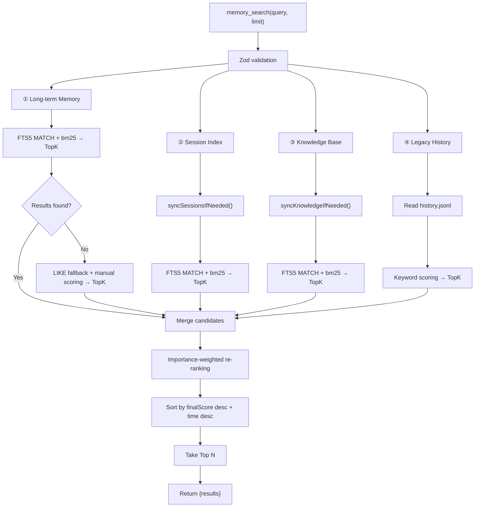
```mermaid
flowchart TD
    A["memory_search(query, limit)"] --> B["Zod validation"]

    B --> C1["① Long-term Memory"]
    C1 --> C1a["FTS5 MATCH + bm25 → TopK"]
    C1a --> C1b{Results found?}
    C1b -->|No| C1c["LIKE fallback + manual scoring → TopK"]
    C1b -->|Yes| MERGE
    C1c --> MERGE

    B --> C2["② Session Index"]
    C2 --> C2a["syncSessionsIfNeeded()"]
    C2a --> C2b["FTS5 MATCH + bm25 → TopK"]
    C2b --> MERGE

    B --> C3["③ Knowledge Base"]
    C3 --> C3a["syncKnowledgeIfNeeded()"]
    C3a --> C3b["FTS5 MATCH + bm25 → TopK"]
    C3b --> MERGE

    B --> C4["④ Legacy History"]
    C4 --> C4a["Read history.jsonl"]
    C4a --> C4b["Keyword scoring → TopK"]
    C4b --> MERGE

    MERGE["Merge candidates"] --> RERANK["Importance-weighted re-ranking"]
    RERANK --> SORT["Sort by finalScore desc + time desc"]
    SORT --> TOP["Take Top N"]
    TOP --> OUT["Return {results}"]
```

### 4.3 memory_forget — Delete Memory

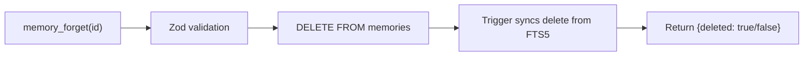
```mermaid
flowchart LR
    A["memory_forget(id)"] --> B["Zod validation"]
    B --> C["DELETE FROM memories"]
    C --> D["Trigger syncs delete from FTS5"]
    D --> E["Return {deleted: true/false}"]
```

### 4.4 Knowledge Index Sync Flow

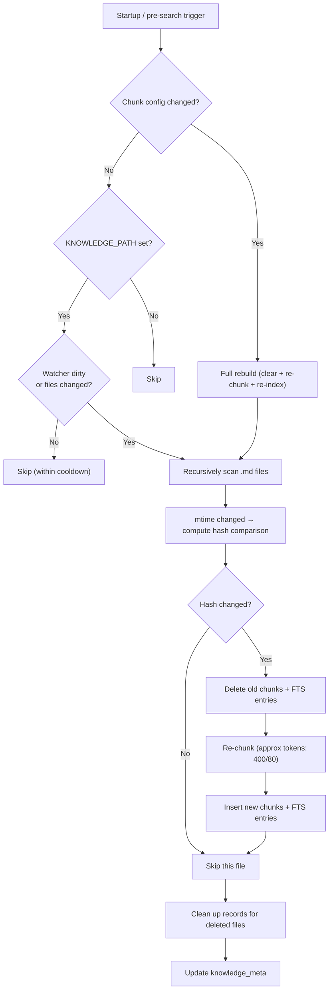
```mermaid
flowchart TD
    START["Startup / pre-search trigger"] --> META{Chunk config changed?}
    META -->|Yes| FULL["Full rebuild (clear + re-chunk + re-index)"]
    META -->|No| CHECK{KNOWLEDGE_PATH set?}

    CHECK -->|No| SKIP["Skip"]
    CHECK -->|Yes| DIRTY{Watcher dirty<br/>or files changed?}

    DIRTY -->|No| SKIP2["Skip (within cooldown)"]
    DIRTY -->|Yes| SCAN["Recursively scan .md files"]

    SCAN --> COMPARE["mtime changed → compute hash comparison"]
    COMPARE --> CHANGED{Hash changed?}
    CHANGED -->|No| NEXT["Skip this file"]
    CHANGED -->|Yes| DELETE["Delete old chunks + FTS entries"]
    DELETE --> CHUNK["Re-chunk (approx tokens: 400/80)"]
    CHUNK --> INSERT["Insert new chunks + FTS entries"]
    INSERT --> NEXT
    NEXT --> CLEAN["Clean up records for deleted files"]
    CLEAN --> SAVEMETA["Update knowledge_meta"]

    FULL --> SCAN
```

### 4.5 Session Index Sync Flow

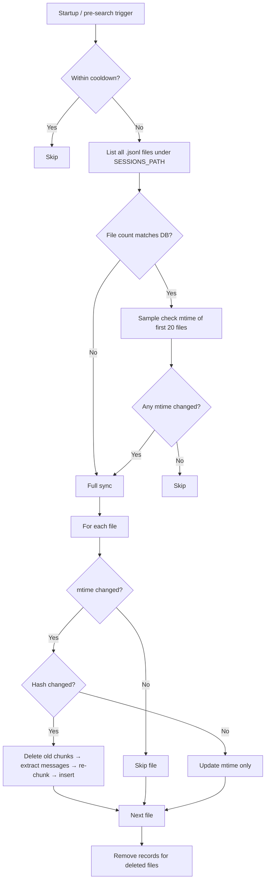
```mermaid
flowchart TD
    START["Startup / pre-search trigger"] --> COOL{Within cooldown?}
    COOL -->|Yes| SKIP["Skip"]
    COOL -->|No| SCAN["List all .jsonl files under SESSIONS_PATH"]

    SCAN --> COUNT{File count matches DB?}
    COUNT -->|No| SYNC["Full sync"]
    COUNT -->|Yes| SAMPLE["Sample check mtime of first 20 files"]
    SAMPLE --> CHANGED{Any mtime changed?}
    CHANGED -->|No| DONE["Skip"]
    CHANGED -->|Yes| SYNC

    SYNC --> ITER["For each file"]
    ITER --> MTIME{mtime changed?}
    MTIME -->|No| SKIPFILE["Skip file"]
    MTIME -->|Yes| HASH{Hash changed?}
    HASH -->|No| UPDATEMTIME["Update mtime only"]
    HASH -->|Yes| REBUILD["Delete old chunks → extract messages → re-chunk → insert"]
    REBUILD --> NEXTFILE["Next file"]
    SKIPFILE --> NEXTFILE
    UPDATEMTIME --> NEXTFILE
    NEXTFILE --> CLEANUP["Remove records for deleted files"]
```

### 4.6 Chunking Strategy

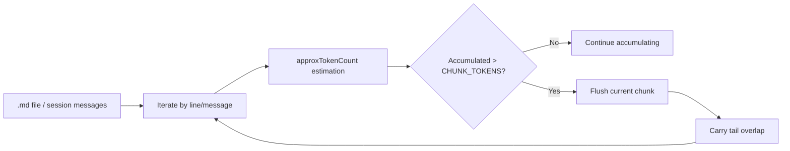
```mermaid
flowchart LR
    A[".md file / session messages"] --> B["Iterate by line/message"]
    B --> C["approxTokenCount estimation"]
    C --> D{Accumulated > CHUNK_TOKENS?}
    D -->|No| E["Continue accumulating"]
    D -->|Yes| F["Flush current chunk"]
    F --> G["Carry tail overlap"]
    G --> B
```

**Approximate token estimation:**
- ASCII characters: 4 chars ≈ 1 token
- Non-ASCII characters (CJK, etc.): 1 char ≈ 1 token

### 4.7 File Watcher (Optional)

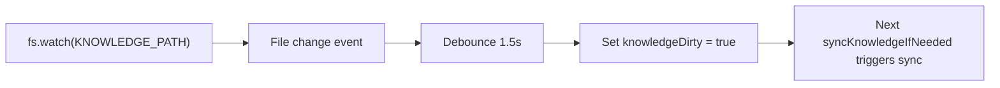
```mermaid
flowchart LR
    A["fs.watch(KNOWLEDGE_PATH)"] --> B["File change event"]
    B --> C["Debounce 1.5s"]
    C --> D["Set knowledgeDirty = true"]
    D --> E["Next syncKnowledgeIfNeeded triggers sync"]
```

- Enabled via `MCP_MEMORY_WATCH=true`
- Uses native Node.js `fs.watch` (recursive mode)
- Debounce prevents excessive triggers

## 5. Retrieval Strategy

### 5.1 Scoring and Ranking

| Source | Retrieval Method | Base Score |
|--------|-----------------|------------|
| Long-term memory | FTS5 MATCH (LIKE fallback) | Negated `bm25()` / manual scoring |
| Session index | FTS5 MATCH | Negated `bm25()` |
| Knowledge index | FTS5 MATCH | Negated `bm25()` |
| Legacy history | Full scan | `scoreText()` keyword scoring |

**Re-ranking strategy:**
- Each source produces TopK candidates first
- `finalScore = baseScore + importanceBoost`
- `importanceBoost` = source weight + structure weight + category weight
- Sort by `finalScore` desc → `createdAt` desc → take Top N

### 5.2 Importance Weights

**Source weights:**
| Source | Weight |
|--------|--------|
| `memory` | 1.0 |
| `knowledge` | 0.9 |
| `session` | 0.75 |
| `history` | 0.6 |

**Category weights:**
| Category | Weight |
|----------|--------|
| `decision` | 0.8 |
| `preference` | 0.6 |
| `fact` | 0.3 |
| `entity` | 0.2 |
| `other` | 0 |

**Structure weights (Markdown):**
| Pattern | Weight |
|---------|--------|
| Headings (`^#`) | 0.6 |
| List items (`^-`/`*`/`\d+\.`) | 0.4 |
| Code blocks (`` ``` ``) | 0.3 |

### 5.3 FTS5 Query Construction

```
Input query: "API configuration method"
  → Tokenize: ["API", "configuration", "method"]
  → FTS5 query: "API"* OR "configuration"* OR "method"*
```

- Punctuation replaced with spaces
- Each token wrapped in `"..."*` for prefix matching
- Multiple tokens joined with `OR`
- `unicode61` tokenizer supports multilingual text

## 6. Startup Sequence

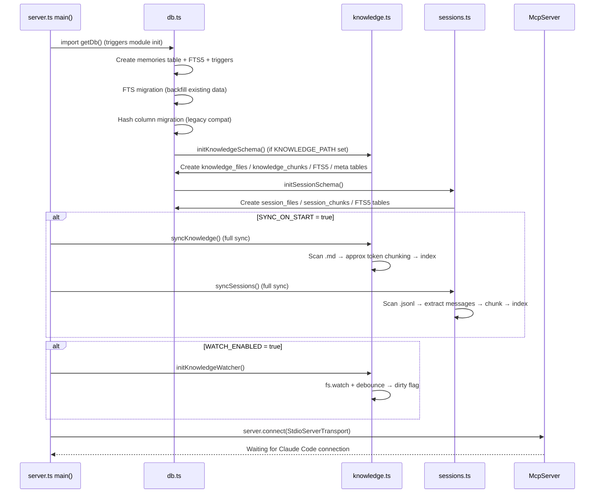
```mermaid
sequenceDiagram
    participant Main as server.ts main()
    participant DB as db.ts
    participant Knowledge as knowledge.ts
    participant Sessions as sessions.ts
    participant MCP as McpServer

    Main->>DB: import getDb() (triggers module init)
    DB->>DB: Create memories table + FTS5 + triggers
    DB->>DB: FTS migration (backfill existing data)
    DB->>DB: Hash column migration (legacy compat)
    DB->>Knowledge: initKnowledgeSchema() (if KNOWLEDGE_PATH set)
    Knowledge->>DB: Create knowledge_files / knowledge_chunks / FTS5 / meta tables
    DB->>Sessions: initSessionSchema()
    Sessions->>DB: Create session_files / session_chunks / FTS5 tables

    alt SYNC_ON_START = true
        Main->>Knowledge: syncKnowledge() (full sync)
        Knowledge->>Knowledge: Scan .md → approx token chunking → index
        Main->>Sessions: syncSessions() (full sync)
        Sessions->>Sessions: Scan .jsonl → extract messages → chunk → index
    end

    alt WATCH_ENABLED = true
        Main->>Knowledge: initKnowledgeWatcher()
        Knowledge->>Knowledge: fs.watch + debounce → dirty flag
    end

    Main->>MCP: server.connect(StdioServerTransport)
    MCP-->>Main: Waiting for Claude Code connection
```

## 7. Configuration Reference

See [README.md — Environment Variables](README.md#environment-variables) for the full configuration table.

## 8. Three-Layer Memory System

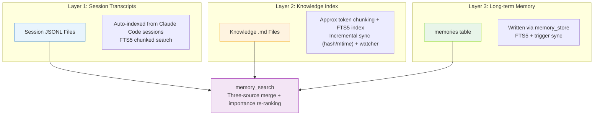
```mermaid
graph TD
    subgraph "Layer 1: Session Transcripts"
        L1["Session JSONL Files"]
        L1D["Auto-indexed from Claude Code sessions<br/>FTS5 chunked search"]
    end

    subgraph "Layer 2: Knowledge Index"
        L2["Knowledge .md Files"]
        L2D["Approx token chunking + FTS5 index<br/>Incremental sync (hash/mtime) + watcher"]
    end

    subgraph "Layer 3: Long-term Memory"
        L3["memories table"]
        L3D["Written via memory_store<br/>FTS5 + trigger sync"]
    end

    L1 --> SEARCH["memory_search<br/>Three-source merge + importance re-ranking"]
    L2 --> SEARCH
    L3 --> SEARCH

    style L1 fill:#e8f4fd,stroke:#4a90d9
    style L2 fill:#fef3e0,stroke:#f5a623
    style L3 fill:#e8f5e9,stroke:#7ed321
    style SEARCH fill:#f3e5f5,stroke:#9c27b0
```

| Layer | Source | Write Method | Index Method | Characteristics |
|-------|--------|-------------|-------------|-----------------|
| Layer 1 | Session JSONL | Auto (Claude Code) | FTS5 chunked index | Zero-config, full transcript search |
| Layer 2 | Knowledge `.md` | User drops files | FTS5 chunked index (approx. tokens) | High precision, requires file maintenance |
| Layer 3 | `memory_store` | Claude Code / user | FTS5 + triggers | Precise, CLAUDE.md-driven |
