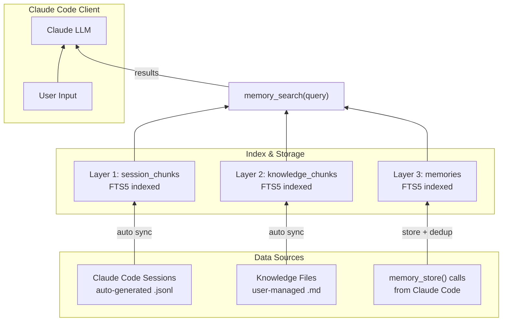

# claudecode-infinite-memory

> A lightweight MCP memory server built on SQLite + FTS5, providing cross-session long-term memory for Claude Code. Supports three-source merged retrieval: long-term memories, session history, and knowledge base indexing.

## Features

- **Long-term memory** — Store and retrieve persistent memories across sessions with deduplication
- **Session indexing** — Automatically indexes Claude Code session transcripts (user + assistant messages)
- **Knowledge base** — Drop `.md` files in a folder and get them auto-indexed with FTS5
- **Three-source search** — Queries all three sources simultaneously with importance-weighted re-ranking
- **Incremental sync** — Only re-indexes files that actually changed (hash + mtime detection)
- **Zero external model dependencies** — Pure keyword-based retrieval using FTS5 BM25, no embedding models needed

## How It Works



## Requirements

- Node.js 18+ (20+ recommended)
- Run `npm install` in the project directory

## Quick Start

```bash
# Development mode (stdio)
npm run dev

# Production build
npm run build
npm start
```

## Integration with Claude Code

Add the following to your Claude Code MCP config (`~/.claude.json`):

```json
{
  "mcpServers": {
    "claudecode-infinite-memory": {
      "command": "npm",
      "args": ["--prefix", "/path/to/claudecode-infinite-memory", "run", "-s", "dev"],
      "env": {
        "MCP_MEMORY_DB_PATH": "/path/to/claudecode-infinite-memory/memory.sqlite",
        "MCP_MEMORY_CLAUDE_HISTORY_PATH": "~/.claude/history.jsonl",
        "MCP_MEMORY_SESSIONS_PATH": "~/.claude/projects",
        "MCP_MEMORY_KNOWLEDGE_PATH": "/path/to/your/knowledge-base",
        "MCP_MEMORY_DEFAULT_LIMIT": "5",
        "MCP_MEMORY_MAX_LIMIT": "20",
        "MCP_MEMORY_WATCH": "false"
      }
    }
  }
}
```

> Replace `/path/to/...` with your actual paths. Merge into your existing `mcpServers` if needed.

## Tools

### `memory_store(text, category?)`

Store a long-term memory entry.

- **`text`** (required) — The memory content
- **`category`** (optional) — One of: `preference`, `fact`, `decision`, `entity`, `other`
- **Deduplication** — Uses `sha256(text + category)` as a unique hash. Duplicate writes return `action: "duplicate"`, successful writes return `action: "stored"`.

### `memory_search(query, limit?)`

Search across all three data sources with merged ranking.

**Data sources:**
1. **Long-term memories** (`memories` table) — FTS5 full-text search with BM25 ranking, LIKE fallback
2. **Session history** (session JSONL files) — FTS5 full-text search on indexed session transcripts
3. **Knowledge base** (`knowledge_chunks` table) — FTS5 full-text search on chunked `.md` files

**Ranking strategy:**
- Each source produces TopK candidates (`limit * 5`, capped at 50)
- Results are re-ranked: `finalScore = baseScore + importanceBoost`
- Importance boost factors: source weight + structure weight + category weight
- Final results sorted by `finalScore` desc, then `createdAt` desc

### `memory_forget(id)`

Delete a specific memory entry by ID. Returns `{ deleted: true | false }`.

## Environment Variables

| Variable | Default | Description |
|----------|---------|-------------|
| `MCP_MEMORY_DB_PATH` | `./memory.sqlite` | SQLite database path |
| `MCP_MEMORY_CLAUDE_HISTORY_PATH` | `~/.claude/history.jsonl` | Claude Code session history file |
| `MCP_MEMORY_SESSIONS_PATH` | `~/.claude/projects` | Directory containing session JSONL files |
| `MCP_MEMORY_KNOWLEDGE_PATH` | _(empty, disabled)_ | Knowledge directory path; put `.md` files here for auto-indexing |
| `MCP_MEMORY_DEFAULT_LIMIT` | `5` | Default search result count |
| `MCP_MEMORY_MAX_LIMIT` | `20` | Maximum search result count |
| `MCP_MEMORY_CHUNK_TOKENS` | `400` | Knowledge indexing chunk size (approximate tokens) |
| `MCP_MEMORY_CHUNK_OVERLAP_TOKENS` | `80` | Chunk overlap size (approximate tokens) |
| `MCP_MEMORY_SYNC_COOLDOWN_MS` | `5000` | Cooldown before incremental sync on search (ms) |
| `MCP_MEMORY_SYNC_ON_START` | `true` | Full sync on server startup |
| `MCP_MEMORY_WATCH` | `false` | Enable file watcher for knowledge directory |
| `MCP_MEMORY_WATCH_DEBOUNCE_MS` | `1500` | File watcher debounce interval (ms) |

## Knowledge Base (Layer 2)

Set `MCP_MEMORY_KNOWLEDGE_PATH` to a directory containing `.md` files.

**How it works:**
- **On startup** — Full scan, approximate token-based chunking (default 400 tokens/chunk, 80 overlap), FTS5 indexing
- **On search** — Cooldown check + change detection, incremental rebuild if needed
- **Incremental sync** — mtime change triggers hash comparison, only changed files are re-chunked
- **Deletion sync** — Files removed from disk are automatically cleaned from the index
- **Config change rebuild** — Changing chunk parameters triggers a full rebuild (detected via `knowledge_meta`)
- **File watcher (optional)** — Set `MCP_MEMORY_WATCH=true` for `fs.watch`-based monitoring with debounce

When `MCP_MEMORY_KNOWLEDGE_PATH` is not set, this feature is silently skipped.

## Three-Layer Memory Architecture

| Layer | Source | Write Method | Index Method | Characteristics |
|-------|--------|-------------|-------------|-----------------|
| Layer 1 | Session JSONL files | Auto (Claude Code) | FTS5 chunked index | Zero-config, session transcript search |
| Layer 2 | Knowledge `.md` files | Manual (user drops files) | FTS5 chunked index (approx. tokens) | High precision, requires file maintenance |
| Layer 3 | `memory_store` calls | Claude Code / user-triggered | FTS5 + triggers | Precise, driven by CLAUDE.md instructions |

See [ARCHITECTURE.md](ARCHITECTURE.md) for detailed technical documentation.
